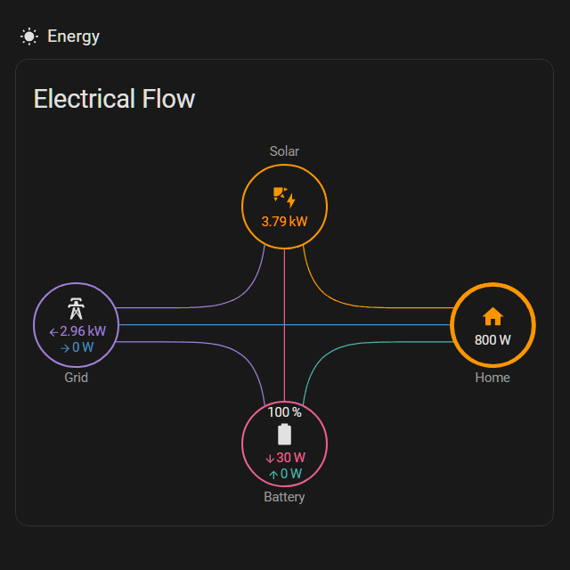
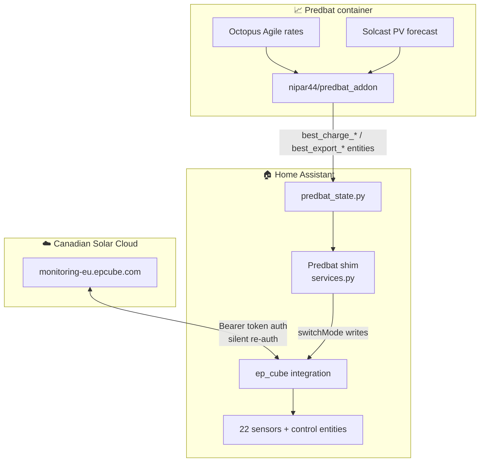

<div align="center">

# ☀️ EP Cube Integration ☀️

**Home Assistant integration for the Canadian Solar EP Cube residential battery**
*with a Predbat-compatible shim for Octopus Agile tariff optimisation*

[](https://www.home-assistant.io/)
[](https://python.org)
[](LICENSE)
[](../../actions)
[-orange)](#-roadmap)
[](#-roadmap)

</div>

---

> [!WARNING]
> **Pre-alpha.** APIs and entity shapes will change before HACS distribution (Phase 4). Not yet recommended for production setups.

---

<div align="center">



*A live drop-in Lovelace dashboard that mirrors the EP Cube mobile app — animated power flow, mode-aware controls, ships with the integration.*

</div>

---

## ✨ What You Get

- 🔋 **22 sensors + 5 control entities** surfacing every cube state — SoC, power flow, mode, reserves, daily energy, lifetime stats
- ⚡ **Predbat shim** translates rate-based commands into the cube's TOU model — full **Octopus Agile** optimisation, no manual scheduling
- 🎨 **Drop-in animated dashboard** mirroring the EP Cube mobile app — power flow, mode picker, mode-specific control cards
- 🌍 **Multi-region** — EU live, US/JP/Other supported via config-flow region picker
- 🔐 **One-time email + password setup** with silent re-auth on token expiry — no JSESSIONID-paste UX, no recurring auth chores
- 🧪 **150-test pytest suite + CI** on every PR

---

## ⚡ Quick Start

> [!IMPORTANT]
> HACS auto-install isn't live yet (Phase 4 — pending the first `v0.5.0` tag). Manual install for now:

**1. Install the integration**

```bash
cd /path/to/homeassistant/config
mkdir -p custom_components
git clone https://github.com/SkiLtY/ha-ep-cube /tmp/ha-ep-cube
cp -r /tmp/ha-ep-cube/custom_components/ep_cube custom_components/
```

**2. Restart Home Assistant**

**3. Add the integration**

Settings → *Devices & services* → *Add integration* → search **Canadian Solar EP Cube** → enter your **region**, the **email + password** for the EP Cube mobile app, and submit.

The integration runs the captcha-solving login flow, fetches your device list, and registers 22 sensors + 5 control entities under one device.

> [!TIP]
> **Want Predbat / Octopus Agile optimisation too?** After the integration is live, also:
> 1. Copy `examples/ha_config/` into your HA config dir (or merge into your existing `configuration.yaml`) — adds the Riemann daily-kWh sensors Predbat needs.
> 2. Install Predbat via the [`nipar44/predbat_addon` Docker container](https://github.com/nipar44/predbat_addon). Full runbook in [docs/PREDBAT.md](docs/PREDBAT.md).
>
> **Want the animated power-flow dashboard?** See [Dashboard](#-dashboard) — one HACS frontend card + one paste of `dashboards/ep_cube.yaml`.

---

## 🌍 Supported Regions

| Region | Host | Status |
|--------|------|--------|
| **EU** | `monitoring-eu.epcube.com` | ✅ Verified live (UK, DE, IT, NL, FR, ES, …) |
| **US** | `epcube-monitoring.com` (path prefix `/app-api`) | 🧪 Experimental — host derived from public sources, not live-tested. Please open an issue with your result. |
| **JP** | `monitoring-jp.epcube.com` | ⬜ Untested |
| **Other** | User-supplied | Escape hatch for AU, CA, custom mocks, or any market where the above is wrong. Capture the host from your app's network traffic and paste it in. |

---

## 📡 Sensors

22 sensors, all grouped under one device per EP Cube:

| Group | Sensors |
|-------|---------|
| **Battery** | `battery_soc` · `battery_soc_kwh` · `battery_capacity_kwh` · `battery_power` · `battery_charge_today` · `battery_discharge_today` |
| **Power flow** | `grid_power` · `solar_power` · `load_power` |
| **Daily energy (kWh)** | `solar_today` · `grid_today` · `backup_today` · `nonbackup_today` · `solar_dc_today` · `solar_ac_today` |
| **Mode + reserve** | `operating_mode` · `reserve_soc` |
| **Lifetime / KPI** | `self_consumption_pct` · `earning_yesterday` · `grid_outage_count` · `off_grid_seconds` · `winter_protect` |

---

## ⚙️ Services

### Predbat Shim (`services.py`)

All shim services accept only an optional `device_id`. Window and SoC parameters are read from the entities Predbat publishes — see [docs/ARCHITECTURE.md](docs/ARCHITECTURE.md) for the full contract.

| Service | Purpose |
|---------|---------|
| `ep_cube.charge_start` | Force grid charge until end of Predbat's planned charge window; target SoC from `best_charge_limit` |
| `ep_cube.charge_stop` | Cancel active charge override, restore baseline |
| `ep_cube.discharge_start` | Force discharge until end of planned export window; target SoC from `best_export_limit` |
| `ep_cube.discharge_stop` | Cancel active discharge override |
| `ep_cube.charge_freeze` | Hold battery at current SoC until end of charge window |
| `ep_cube.discharge_freeze` | Alias for `charge_freeze`; end-time taken from export window |
| `ep_cube.idle` | Restore baseline TOU schedule |

### TOU Schedule (`set_tou_schedule`)

Replaces the cube's workday + weekend non-DST tier lists in one POST. DST tier lists, day masks, reserves, and per-tier prices are preserved from the cube's current state. If a Predbat shim override is in flight when called, it is abandoned (user-wins).

| Field | Type | Notes |
|-------|------|-------|
| `peak_workday`, `mid_peak_workday`, `off_peak_workday` | `list[str]` | "HH:MM-HH:MM" slots for the workday tier |
| `peak_weekend`, `mid_peak_weekend`, `off_peak_weekend` | `list[str]` | "HH:MM-HH:MM" slots for the weekend tier |
| `switch_to_tou` | `bool` (default `false`) | If true, also flip the cube into Time-of-Use mode after writing |
| `device_id` | `str` (optional) | Only required if multiple cubes are configured |

Slots are validated server-side for format, within-tier overlap, and cross-tier overlap. Slots can't cross midnight — use `23:59` to end a slot at the end of the day (matches the EP Cube mobile app's convention; the cube's wire format rejects `end <= start`). The bundled [TOU Schedule Editor card](#-dashboard) drives this service from a UI form.

Mode switching and reserve-SoC writes are exposed as **entities**, not services:

```
select.ep_cube_operating_mode
switch.ep_cube_allow_grid_charge
number.ep_cube_self_consumption_reserve
number.ep_cube_backup_reserve
```

Call `select.select_option` / `number.set_value` from automations.

---

## 🧩 Helper Config (Optional)

The integration installs cleanly on a default HA setup. Two optional extras live in [`examples/ha_config/`](examples/ha_config/):

- **`packages/ep_cube.yaml`** — Riemann daily kWh sensors (load / PV / signed grid import / signed grid export), `utility_meter` monthly + yearly rollups, and `input_number` charge / discharge rate entities.
- **`configuration.yaml`** — minimal example showing the `homeassistant.packages` block.

| Use case | Need the package? |
|----------|:-----------------:|
| Running Predbat | ✅ Yes — `load_today` is a hard dependency; `charge_rate`/`discharge_rate` must be writable `input_number` entities |
| Monthly/yearly history in Energy dashboard | ✅ Recommended |
| Just install and view live sensors | ❌ No |

**To install:** copy `examples/ha_config/` into your HA config directory (merging into any existing `configuration.yaml`), then restart HA.

---

## 📊 Dashboard

[`dashboards/ep_cube.yaml`](dashboards/ep_cube.yaml) is a drop-in Lovelace dashboard mirroring the EP Cube mobile app: animated power flow, battery status, operating-mode picker, and mode-specific control cards that swap automatically when you change mode. (See the [animated demo](#) at the top of this README.)

**Install steps:**

1. **Power Flow Card Plus** — HACS → Frontend → search "Power Flow Card Plus" by [flixlix](https://github.com/flixlix/power-flow-card-plus) → Install → restart HA.
2. **TOU Schedule Editor card** *(optional — only needed if you want to edit the cube's Time-of-Use slots from HA)*:
   - Copy [`www/ep-cube-tou-editor.js`](www/ep-cube-tou-editor.js) into your HA config's `www/` directory (so the path is `/config/www/ep-cube-tou-editor.js`).
   - Settings → Dashboards → Resources → ⊕ Add Resource → URL `/local/ep-cube-tou-editor.js`, type *JavaScript module* → Create.
   - Restart your browser (hard refresh) so HA picks up the new module.
3. **New dashboard** — Settings → Dashboards → Add Dashboard → "New dashboard from scratch" (title: *EP Cube*, icon: `mdi:home-battery`).
4. **Paste YAML** — open dashboard → Edit → ⋮ → *Raw configuration editor* → replace contents with [`dashboards/ep_cube.yaml`](dashboards/ep_cube.yaml) → Save.

> [!TIP]
> Entity IDs assume the default device name `EP Cube`. If you renamed the device, or have multiple cubes, edit the YAML accordingly — HA appends `_2`, `_3`, etc. to disambiguate.

The TOU schedule editor card (Phase 4.1, shipped in v0.6.0) writes the cube's workday + weekend tier lists in one POST via [`ep_cube.set_tou_schedule`](#-services). DST tier lists, reserves and per-tier prices are preserved server-side from the cube's current state.

---

## ⚡ Energy Dashboard

The integration ships four daily kWh sensors mirroring the cube's onboard counters, plus a self-consumption KPI. Monthly/yearly rollups are added via `utility_meter` in the helper package.

Wire them into HA's **Energy dashboard** (Settings → Dashboards → Energy):

| Slot | Entity | Notes |
|------|--------|-------|
| Solar production | `sensor.ep_cube_solar_today` | Built-in |
| Grid consumption | `sensor.ep_cube_import_today` | ⚠️ Requires the [helper package](#-helper-config-optional) — Riemann-integrated, monotonic import, resets daily |
| Return to grid | `sensor.ep_cube_export_today` | ⚠️ Requires the helper package — Riemann-integrated, monotonic export, resets daily |
| Home battery SoC | `sensor.ep_cube_battery_soc_kwh` | Built-in |

> [!WARNING]
> **Do not use `sensor.ep_cube_grid_today`** in the Energy dashboard. The cube-native counter reports total grid throughput as a direction-ambiguous magnitude — on mixed import/export days, direction is hidden. Verified 2026-05-24. Use the Riemann sensors above instead.

---

<details>
<summary><h2>🛠️ For contributors</h2></summary>

### 💡 Why This Exists

The EP Cube has **no documented local API** — no Modbus, no MQTT. All control goes through Canadian Solar's cloud via mobile-app endpoints.

One existing community integration exists ([Bobsilvio/epcube](https://github.com/Bobsilvio/epcube)) but carries no licence file, so it cannot legally be forked. This is a **clean-room build**.

**The end goal:** working Octopus Agile tariff optimisation via [Predbat](https://github.com/springfall2008/batpred). Predbat operates on a rate-based, time-windowed contract; the EP Cube exposes a mode + TOU-schedule contract. This integration includes a **shim service layer** that translates between the two.

### 🗺 Architecture



### 📁 Layout

```
ha-ep-cube/
├── custom_components/ep_cube/      ← HA integration (HACS-installable, Phase 4)
│   ├── services.py                 ← Predbat shim service handlers
│   └── predbat_state.py            ← Reads predbat.best_charge_* / best_export_* entities
├── mock_server/                    ← FastAPI mock of the EP Cube cloud (dev without hardware)
├── dashboards/
│   └── ep_cube.yaml                ← Lovelace dashboard (animated power flow + mode controls)
├── examples/
│   └── ha_config/                  ← Drop-in YAML for Predbat helpers + Energy dashboard rollups
├── docs/
│   ├── ARCHITECTURE.md             ← Predbat shim contract + design notes
│   ├── PREDBAT.md                  ← Predbat install + tariff (BottlecapDave) + Solcast runbook
│   ├── PHASE_3_2.md                ← Bearer-token + captcha refactor notes
│   ├── MITMPROXY_SETUP.md          ← Cloud-API capture tooling (for contributors)
│   ├── TROUBLESHOOTING.md          ← Known wire-level gotchas
│   └── predbat_apps.yaml.example   ← Predbat custom-inverter template
└── docker-compose.yml              ← HA + mock-server stack
```

### 🚀 Dev Setup

**Requires Docker.**

```bash
git clone https://github.com/SkiLtY/ha-ep-cube
cd ha-ep-cube
docker compose up -d
```

This brings up:

| Service | URL | Notes |
|---------|-----|-------|
| Home Assistant | http://localhost:8123 | `custom_components/ep_cube/` volume-mounted |
| Mock EP Cube cloud | http://localhost:8765 | FastAPI mock of the mobile-app surface |

Add the integration via HA's UI:

1. Settings → Devices & services → Add integration → *Canadian Solar EP Cube*
2. Region: **Other** (escape hatch for custom hosts)
3. Base URL: `http://mock:8765` (Docker network DNS)
4. API prefix: `/api`
5. Username + password: any string — the mock accepts anything and returns a stub Bearer token

The mock's `deviceList` resolves a single device (`devId=5613`); no manual ID needed.

### Running Tests

```bash
pip install -r requirements-test.txt
pytest
```

Tests use [`pytest-homeassistant-custom-component`](https://github.com/MatthewFlamm/pytest-homeassistant-custom-component) and run without Docker. The CI matrix (`.github/workflows/validate.yml`) runs the same on **Python 3.12** against every PR and weekly. (3.13 is pending an aiodns/pycares fix in HA's test stack.)

Coverage spans: API client (envelope unwrapping, 403→re-auth retry, `switch_mode` verification), Predbat shim (idempotency, baseline snapshotting, auto-revert), `predbat_state` parsing, config flow (region routing + migration), and entity registration.

### 🏗 HA Install Type

This stack uses **HA Container** (lightweight, no Supervisor). HA Container cannot install add-ons — Predbat runs as a sibling **`nipar44/predbat_addon`** Docker container (the upstream-recommended replacement for the now-deprecated AppDaemon install path). See [docs/PREDBAT.md](docs/PREDBAT.md).

</details>

---

## 🛣 Roadmap

| Phase | Status | What |
|-------|:------:|------|
| 1 | ✅ | Mock cloud + HA integration skeleton + 9 sensors + DeviceInfo |
| 2a | ✅ | Predbat shim: 7 services, baseline snapshot, idempotency, auto-revert |
| 2b | ✅ | Predbat as `nipar44/predbat_addon` container, plan loop validated end-to-end |
| 2b.1 | ✅ | Shim reads params from `predbat.best_charge_*` / `predbat.best_export_*` entities |
| 2c | ✅ | Live Octopus Agile rates via public REST API (no Octopus account required) |
| 2c+ | ✅ | Solcast PV forecast wired in (split E/W array) |
| 3 | ✅ | Hardware reconciliation — live cloud bring-up against `monitoring-eu.epcube.com` |
| 3.1 | ✅ | `charge_freeze` → mid-peak TOU slot; force-export gap documented; stable device name |
| 3.2 | ✅ | Mobile-app Bearer-token auth replaces JSESSIONID-cookie paste |
| 3.3 | ✅ | Animated power-flow Lovelace dashboard |
| 3.4 | ✅ | Feature-parity vs Bobsilvio/epcube — control entities + daily kWh sensors + i18n |
| 3.5 | ✅ | Bobsilvio-parity metrics expansion — 5 sensors + 4 `utility_meter` rollups |
| **4** | ✅ | **HACS distribution** — first release [`v0.5.0`](https://github.com/SkiLtY/ha-ep-cube/releases/tag/v0.5.0) shipped 2026-05-28. 150-test pytest suite + CI matrix, demo-first README, curated release-notes workflow, brand assets self-hosted, helpers shipped. HACS Default submission held for next session. |
| 4.1 | 🎯 next | TOU schedule editor — `set_tou_schedule` service + Lovelace editor card (post-HACS) |
| 4.2 | ⏸️ | Cloud-stats expansion — `queryDataElectricityV2`, signed grid import/export, `*_yesterday` variants, lifetime totals |
| 4+ | ⏸️ | [HomeAssistant-OctopusEnergy](https://github.com/BottlecapDave/HomeAssistant-OctopusEnergy) — half-hourly smart-meter consumption replaces Riemann `load_today`. Gated on Octopus Home Mini arrival. |

---

## ☕ About + Support

> **Hacking life to keep it simple. Solving technical challenges along the way.**
>
> I'm an integration engineer who loves taking complex technical puzzles and turning them into simple solutions.
>
> When I'm not at a terminal, you'll usually find me logging miles in the pool or on the bike, training for that next aquabike event.
>
> If any of my tools, scripts, or tinkering have helped you solve a challenge of your own, tossing a ko-fi in the tank helps keep the engine running. Thanks for the support! ☕

<div align="center">

[](https://ko-fi.com/SkiLtY)

</div>

— **Michael Skilton** ([@SkiLtY](https://github.com/SkiLtY))

---

## 📄 Licence

MIT — see [LICENSE](LICENSE).

*Not affiliated with or endorsed by Canadian Solar or EP Cube.*
